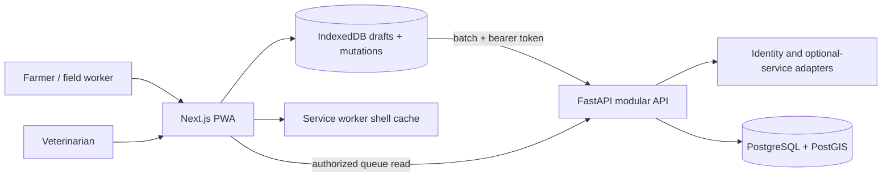
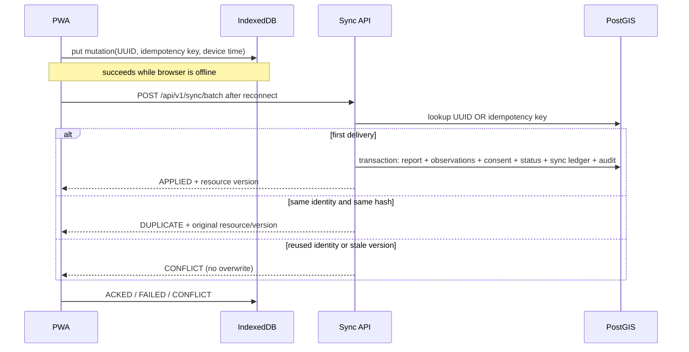

# Checkpoint 1 architecture

## System shape

The repository is a modular monolith with a separately deployed PWA and PostgreSQL
database. Clear adapter and domain boundaries allow later extraction without adding
distributed failure modes during the foundational checkpoint.

## Synchronization sequence

## API modules

- `core`: validated settings, JWT signing/verification, structured logging, redaction,
  request IDs, and tamper-evident audit chaining.
- `adapters`: development identity, unavailable optional analysis providers, and media
  storage interface.
- `domain`: typed SQLAlchemy entities, farm/report access rules, and mutation service.
- `schemas`: Pydantic versioned transport contracts; FastAPI OpenAPI is canonical.
- `api/routes`: system health, authentication, registry, synchronization, reports,
  veterinarian queue, and administrative audit viewer.

## Database decisions

- PostgreSQL UUID keys; report and mutation IDs are generated by the client.
- Location is `GEOGRAPHY(Point,4326)` with GiST indexes. Latitude/longitude are also
  typed columns for authorized API serialization; geography is the spatial source.
- Raw guided observations, flexible provider availability, later features, risk
  assessments, explanations, human reviews, and lab truth are distinct entities.
- Stable report fields are typed columns. JSONB is limited to bounded provider state,
  versioned features/results, notification payloads, and provenance.
- Unique constraints cover report client mutation ID, idempotency key, and sync ledger
  identities. The request hash prevents key reuse with altered content.
- `version` implements optimistic concurrency; stale updates never silently win.
- Audit records carry a SHA-256 hash of safe event metadata plus the previous entry
  hash. This is tamper-evident, not an external immutable ledger.

## Security boundaries

The development adapter authenticates only seeded synthetic email/role pairs and a
fixed local password, then issues time-limited HMAC tokens. It is disabled entirely
when `DEV_AUTH_ENABLED=false`. A real deployment must supply OIDC, secret rotation,
HTTPS, hardened cookie/token handling, media authorization, rate limiting, and an
external audit-integrity/backup strategy.

